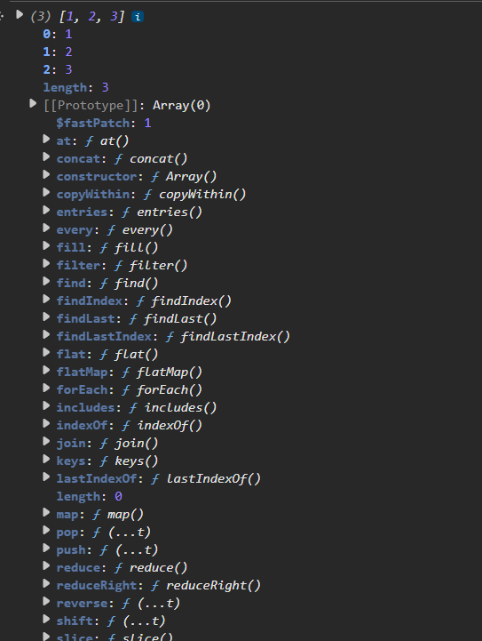

# Object-Oriented Programming (OOP) in JavaScript

JavaScript is a **prototype based programming language** (under the hood). But as many programmers come to this language having studied OOP, so now JS also offers all kinds of keywords like classes, constructors, inheritance and everything. So now we will be studying first prototype based language and then moving forward with OOP.

## Prototype-Based Nature

Open console and write this code to see that JS is actually prototype based under the hood supporting all OOP fundamentals:

```javascript
let myVal = [1,2,3];
myVal
```

This is what we got as output:


**Prototype** means functionality or extra property in any given datatype. All implementations, all methods like push, pop, shift, foreach and everything is an object in JS world.

Prototype purpose is to define properties and methods that can be shared by all instances of an object.

## OOP Fundamentals

OOP is the ability to create objects. Objects can be created by construction function also.

**4 concepts:** encapsulation, inheritance, polymorphism, abstraction

We want to create objects which are instances of the classes. Even the classes under the hood is an object.

## Inheritance in JavaScript

Below all examples show inheritance in JavaScript classes:

```javascript
class Animal {}
class Dog extends Animal {}
```

```javascript
function Animal(){}
function Dog (){
    Animal.call(this);
}
```

```javascript
let Dog = Object.create(Animal.prototype);
```

## Key Concepts

**Encapsulation** is ability to hide internal details and show only necessary parts of an object.

**"super"** is the keyword used in JavaScript to call the constructor of a parent class from a derived class, allowing you to access its properties and methods effectively.

**Polymorphism** is ability of different objects to respond to same function or method call in different ways.

**Getters** are used to fetch data and **setters** are used to modify data providing a way to control access to